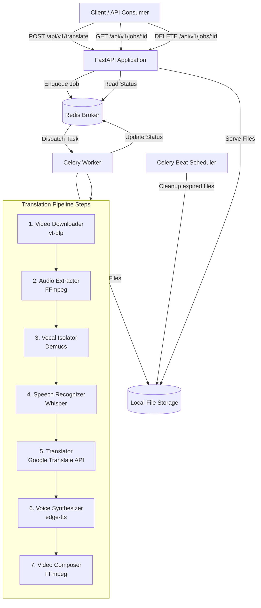

# Design Document

## Overview

Douyin Video Translator là một standalone Python backend service sử dụng kiến trúc pipeline xử lý bất đồng bộ. Hệ thống nhận Douyin URL từ REST API, xử lý video qua 6 bước tuần tự (tải video → tách âm → nhận dạng giọng nói → dịch → tổng hợp giọng → ghép video), và trả về video đầu ra với giọng thuyết minh tiếng Việt.

**Công nghệ chính:**
- **Framework**: FastAPI (Python 3.11+)
- **Task Queue**: Celery + Redis (xử lý background cho pipeline dài)
- **Video Download**: yt-dlp (hỗ trợ Douyin extractor)
- **Audio Extraction & Vocal Isolation**: FFmpeg + Demucs (Meta Research)
- **Speech-to-Text**: OpenAI Whisper large-v3 (hỗ trợ tiếng Trung với độ chính xác cao)
- **Translation**: Google Cloud Translation API v2 (Chinese → Vietnamese)
- **Text-to-Speech**: edge-tts (Microsoft Edge TTS, hỗ trợ giọng tiếng Việt tự nhiên, miễn phí)
- **Video Composition**: FFmpeg (ghép audio track, mix nhạc nền)
- **Storage**: Local filesystem + scheduled cleanup

**Quyết định thiết kế chính:**
1. Chọn Celery + Redis thay vì FastAPI BackgroundTasks vì pipeline xử lý video có thể kéo dài nhiều phút, cần khả năng retry từng bước, theo dõi trạng thái, và không bị mất khi server restart.
2. Chọn Demucs cho vocal isolation vì đây là state-of-the-art model từ Meta Research, tách vocals khỏi nhạc nền rất tốt.
3. Chọn Whisper large-v3 vì đạt word error rate thấp cho tiếng Trung, hỗ trợ timestamp level ở mức từ/câu.
4. Chọn edge-tts vì miễn phí, không cần API key, hỗ trợ nhiều giọng tiếng Việt tự nhiên (nam/nữ).

## Architecture



### Luồng xử lý chính

1. Client gửi POST request với Douyin URL
2. FastAPI validate URL, tạo job record, trả về HTTP 202 với job ID
3. Celery worker nhận task, thực thi pipeline tuần tự
4. Mỗi bước cập nhật trạng thái vào Redis (progress tracking)
5. Client poll trạng thái qua GET endpoint
6. Khi hoàn tất, client nhận link download video đầu ra
7. Celery Beat scheduler dọn file hết hạn sau 24 giờ

## Components and Interfaces

### 1. API Layer (FastAPI)

```python
# POST /api/v1/translate
class TranslateRequest(BaseModel):
    url: str  # Douyin URL

class TranslateResponse(BaseModel):
    job_id: str
    status: str  # "queued"
    message: str

# GET /api/v1/jobs/{job_id}
class JobStatusResponse(BaseModel):
    job_id: str
    status: str  # queued | processing | completed | failed | cancelled
    current_step: str | None  # downloading | extracting_audio | isolating_vocals | recognizing_speech | translating | synthesizing_voice | composing_video
    progress_percent: int  # 0-100
    video_info: VideoInfo | None
    download_url: str | None
    error: ErrorDetail | None
    created_at: datetime
    expires_at: datetime | None

# DELETE /api/v1/jobs/{job_id}
class CancelResponse(BaseModel):
    job_id: str
    status: str  # "cancelled"
```

### 2. Video Downloader Module

```python
class VideoDownloader:
    async def download(self, url: str, output_dir: Path) -> DownloadResult:
        """Download video from Douyin URL using yt-dlp."""
        ...
    
    def validate_url(self, url: str) -> bool:
        """Check if URL belongs to douyin.com domain."""
        ...
    
    def get_video_info(self, url: str) -> VideoInfo:
        """Extract video metadata without downloading."""
        ...
```

**Interface:** Nhận Douyin URL, trả về path tới file MP4 + metadata (duration, resolution, filesize).

### 3. Audio Extractor Module

```python
class AudioExtractor:
    def extract(self, video_path: Path, output_dir: Path) -> Path:
        """Extract audio track from video as WAV file using FFmpeg."""
        ...
    
    def has_audio_track(self, video_path: Path) -> bool:
        """Check if video contains an audio stream."""
        ...
```

**Interface:** Nhận path video MP4, trả về path tới file WAV.

### 4. Vocal Isolator Module

```python
class VocalIsolator:
    def isolate(self, audio_path: Path, output_dir: Path) -> VocalIsolationResult:
        """Separate vocals from background music using Demucs."""
        ...

class VocalIsolationResult:
    vocals_path: Path       # Isolated vocals
    background_path: Path   # Background music/instrumental
```

**Interface:** Nhận file WAV đầy đủ, trả về 2 file: vocals (giọng nói) và background (nhạc nền).

### 5. Speech Recognizer Module

```python
class SpeechRecognizer:
    def recognize(self, audio_path: Path) -> TranscriptionResult:
        """Transcribe Chinese speech to text with timestamps using Whisper."""
        ...

class TranscriptionSegment:
    start: float       # Start time in seconds
    end: float         # End time in seconds  
    text: str          # Chinese text
    speaker: str | None  # Speaker label if multi-speaker detected

class TranscriptionResult:
    segments: list[TranscriptionSegment]
    full_text: str
    language: str      # Detected language code
    confidence: float  # Overall confidence score
```

**Interface:** Nhận file WAV vocals, trả về danh sách segments với timestamp và text tiếng Trung.

### 6. Translator Module

```python
class Translator:
    def translate(self, transcription: TranscriptionResult) -> TranslationResult:
        """Translate Chinese text segments to Vietnamese."""
        ...

class TranslatedSegment:
    start: float
    end: float
    original_text: str    # Chinese
    translated_text: str  # Vietnamese
    speaker: str | None

class TranslationResult:
    segments: list[TranslatedSegment]
    full_text_original: str
    full_text_translated: str
```

**Interface:** Nhận TranscriptionResult, trả về TranslationResult với text tiếng Việt giữ nguyên timestamp.

### 7. Voice Synthesizer Module

```python
class VoiceSynthesizer:
    async def synthesize(self, translation: TranslationResult, output_dir: Path) -> SynthesisResult:
        """Generate Vietnamese TTS audio for each segment using edge-tts."""
        ...
    
    def select_voice(self, speaker: str | None) -> str:
        """Select appropriate Vietnamese voice for speaker."""
        ...

class SynthesisResult:
    audio_path: Path                    # Combined Vietnamese audio
    segment_audios: list[SegmentAudio]  # Individual segment audio files
    
class SegmentAudio:
    path: Path
    start: float
    end: float
    duration: float        # Actual TTS duration
    target_duration: float # Original segment duration
    speed_adjusted: bool   # Whether speed was adjusted to fit
```

**Interface:** Nhận TranslationResult, trả về file audio tiếng Việt đã đồng bộ timing.

### 8. Video Composer Module

```python
class VideoComposer:
    def compose(
        self, 
        video_path: Path, 
        vietnamese_audio: Path,
        background_audio: Path,
        output_dir: Path,
        background_volume: float = 0.2  # 20% volume for background music
    ) -> Path:
        """Merge Vietnamese voiceover with background music into original video."""
        ...
```

**Interface:** Nhận video gốc + audio tiếng Việt + nhạc nền, trả về path tới video MP4 đầu ra (H.264 codec).

### 9. Pipeline Orchestrator

```python
class TranslationPipeline:
    def __init__(
        self,
        downloader: VideoDownloader,
        extractor: AudioExtractor,
        isolator: VocalIsolator,
        recognizer: SpeechRecognizer,
        translator: Translator,
        synthesizer: VoiceSynthesizer,
        composer: VideoComposer,
    ): ...
    
    async def execute(self, job_id: str, url: str) -> PipelineResult:
        """Execute full translation pipeline with progress tracking."""
        ...
    
    async def resume(self, job_id: str, from_step: str) -> PipelineResult:
        """Resume pipeline from a specific step (for retry)."""
        ...
```

## Data Models

### Job State (stored in Redis)

```python
class JobState:
    job_id: str                    # UUID
    url: str                       # Original Douyin URL
    status: JobStatus              # Enum: queued, processing, completed, failed, cancelled
    current_step: PipelineStep | None
    progress_percent: int          # 0-100
    video_info: VideoInfo | None
    download_url: str | None       # URL to download result video
    error: ErrorDetail | None
    created_at: datetime
    updated_at: datetime
    expires_at: datetime | None    # 24h after completion
    
    # Internal paths (not exposed via API)
    work_dir: str                  # Working directory for this job
    artifacts: dict[str, str]      # Step name -> file path mapping

class JobStatus(str, Enum):
    QUEUED = "queued"
    PROCESSING = "processing"
    COMPLETED = "completed"
    FAILED = "failed"
    CANCELLED = "cancelled"

class PipelineStep(str, Enum):
    DOWNLOADING = "downloading"
    EXTRACTING_AUDIO = "extracting_audio"
    ISOLATING_VOCALS = "isolating_vocals"
    RECOGNIZING_SPEECH = "recognizing_speech"
    TRANSLATING = "translating"
    SYNTHESIZING_VOICE = "synthesizing_voice"
    COMPOSING_VIDEO = "composing_video"

class VideoInfo:
    duration_seconds: float
    file_size_bytes: int
    resolution: str              # e.g. "1080x1920"
    title: str | None

class ErrorDetail:
    step: PipelineStep
    message: str
    retryable: bool
    retry_count: int
```

### File Structure (per job)

```
storage/
├── jobs/
│   └── {job_id}/
│       ├── original.mp4          # Downloaded video
│       ├── audio_full.wav        # Extracted full audio
│       ├── vocals.wav            # Isolated vocals
│       ├── background.wav        # Isolated background music
│       ├── transcription.json    # Speech recognition result
│       ├── translation.json      # Translation result  
│       ├── vietnamese_audio.wav  # Synthesized Vietnamese voice
│       └── output.mp4            # Final composed video
```

### Rate Limiting State (Redis)

```python
class RateLimitState:
    user_key: str          # IP address or API key
    active_jobs: int       # Current concurrent job count
    max_concurrent: int    # Default: 5
```


## Correctness Properties

*A property is a characteristic or behavior that should hold true across all valid executions of a system — essentially, a formal statement about what the system should do. Properties serve as the bridge between human-readable specifications and machine-verifiable correctness guarantees.*

### Property 1: URL Validation — Only Douyin URLs Accepted

*For any* URL string, the URL validation function SHALL accept it if and only if it belongs to the douyin.com domain (including subdomains like www.douyin.com, v.douyin.com). All other URLs SHALL be rejected with the error message "URL không hợp lệ, vui lòng cung cấp link Douyin".

**Validates: Requirements 1.2**

### Property 2: Network Retry Logic Bounded at 3 Attempts

*For any* sequence of download attempts where network failures occur, the system SHALL retry at most 3 times. If all 3 retries fail, it SHALL report an error. If any attempt succeeds, it SHALL return success immediately without further retries.

**Validates: Requirements 1.4**

### Property 3: Transcription Segments Temporal Ordering

*For any* transcription result produced by the speech recognizer, all segments SHALL have start < end timestamps, segments SHALL be in chronological order (segment[i].end <= segment[i+1].start), and no two segments SHALL overlap in time.

**Validates: Requirements 3.2**

### Property 4: Translation Preserves Segment Structure and Timestamps

*For any* TranscriptionResult with N segments, the resulting TranslationResult SHALL also have exactly N segments, and for each segment i, the start and end timestamps SHALL be identical to the original transcription segment timestamps.

**Validates: Requirements 4.2**

### Property 5: Non-Chinese or Empty Text Validation

*For any* input string that is empty, contains only whitespace, or contains no Chinese characters (Unicode range \u4e00-\u9fff), the translator SHALL reject it with the error "Không có nội dung tiếng Trung để dịch". Conversely, any string containing at least one Chinese character SHALL pass this validation.

**Validates: Requirements 4.4**

### Property 6: TTS Duration Matches Target Segment Duration

*For any* translated segment with a target duration (end - start), the synthesized audio output for that segment SHALL have a final duration that fits within the target duration (±100ms tolerance). If the raw TTS audio exceeds the target duration, the speed adjustment algorithm SHALL produce audio with duration equal to the target duration without exceeding a 2x speed increase.

**Validates: Requirements 5.2, 5.3**

### Property 7: Distinct Speakers Receive Distinct Voices

*For any* set of translated segments containing multiple distinct speaker labels, the voice synthesizer SHALL assign a different TTS voice ID to each unique speaker label. No two distinct speakers SHALL share the same voice.

**Validates: Requirements 5.4**

### Property 8: Pipeline Step Progression is Monotonic

*For any* pipeline execution, the progress percentage SHALL increase monotonically (never decrease), and step transitions SHALL follow the exact order: downloading → extracting_audio → isolating_vocals → recognizing_speech → translating → synthesizing_voice → composing_video.

**Validates: Requirements 7.1**

### Property 9: Cancellation From Any Active Step

*For any* job in PROCESSING status at any pipeline step, sending a cancel signal SHALL transition the job to CANCELLED status, and the job SHALL NOT proceed to subsequent steps after cancellation.

**Validates: Requirements 7.3**

### Property 10: Pipeline Resume Preserves Prior Artifacts

*For any* pipeline failure at step N, all artifacts produced by steps 1 through N-1 SHALL remain intact on disk. When the pipeline is resumed, it SHALL start execution from step N without re-executing steps 1 through N-1, and the error detail SHALL correctly identify step N as the failed step.

**Validates: Requirements 6.5, 7.4**

### Property 11: API Response Contains Required Fields

*For any* JobState, the serialized API response SHALL always contain the fields: job_id (non-empty string), status (valid enum value), and created_at (valid datetime). When status is "completed", the response SHALL additionally contain download_url (non-empty string) and expires_at (datetime).

**Validates: Requirements 8.2**

### Property 12: Rate Limiting Enforces Maximum 5 Concurrent Jobs

*For any* user, if they have N active jobs (status in [queued, processing]) where N >= 5, any subsequent translate request SHALL be rejected with HTTP 429 status code. If N < 5, the request SHALL be accepted with HTTP 202.

**Validates: Requirements 8.5**

## Error Handling

### Error Categories and Recovery Strategy

| Error Type | Example | Recovery |
|-----------|---------|----------|
| **Validation Error** | Invalid URL format, empty text | Immediate rejection with descriptive message, HTTP 400 |
| **Network Error** | Douyin download timeout, API timeout | Automatic retry (max 3 attempts) with exponential backoff |
| **External Service Error** | Google Translate API failure, edge-tts failure | Retry with backoff, mark step as failed after retries exhausted |
| **Processing Error** | FFmpeg failure, Whisper OOM | Mark step as failed, allow manual retry from that step |
| **Resource Error** | Disk full, Redis unavailable | Log critical error, return HTTP 503 |
| **Rate Limit Error** | >5 concurrent jobs per user | HTTP 429 with Retry-After header |

### Error Response Format

```python
class ErrorResponse(BaseModel):
    error: str           # Error code (e.g., "INVALID_URL", "DOWNLOAD_FAILED")
    message: str         # Human-readable Vietnamese message
    step: str | None     # Pipeline step where error occurred (if applicable)
    retryable: bool      # Whether the operation can be retried
    retry_after: int | None  # Seconds to wait before retry (for rate limiting)
```

### Per-Step Error Handling

1. **Video Download**: Retry 3x with 2s/4s/8s backoff. Handle 404 (video removed), network timeout, and geo-blocking separately.
2. **Audio Extraction**: Fail immediately if no audio track detected. FFmpeg errors are not retryable.
3. **Vocal Isolation**: Demucs OOM → fail with recommendation to use smaller model. Model loading errors → retry once.
4. **Speech Recognition**: Whisper timeout → retry with shorter audio segments. Empty result → report "no speech detected".
5. **Translation**: Google API quota exceeded → wait and retry. Network error → retry 3x.
6. **Voice Synthesis**: edge-tts connection error → retry 3x. Invalid text → fail with detail.
7. **Video Composition**: FFmpeg error → fail, allow retry from this step. Disk space → fail with resource error.

### Graceful Degradation

- If vocal isolation partially fails, proceed with full audio (lower quality transcription)
- If speaker diarization fails, use single default voice for all segments
- If speed adjustment exceeds 2x limit, truncate segment rather than distort

## Testing Strategy

### Property-Based Testing (PBT)

**Library**: Hypothesis (Python) — standard PBT library for Python, well-integrated with pytest.

**Configuration**: Minimum 100 iterations per property test.

**Tag Format**: `Feature: douyin-video-translator, Property {number}: {property_text}`

Property-based tests cover the 12 correctness properties defined above. These test the pure logic modules:
- URL validation logic
- Retry state machine
- Timestamp invariants and preservation
- Chinese text detection
- TTS duration fitting algorithm
- Speaker-to-voice mapping
- Pipeline state machine transitions
- API response serialization
- Rate limiting logic

### Unit Tests (Example-Based)

Unit tests complement property tests for specific scenarios:
- Video download with mocked yt-dlp responses (1.3, 1.5)
- Audio extraction from video without audio track (2.3)
- Speech recognition with empty audio (3.3)
- Video composition output format verification (6.4)
- API endpoint HTTP status codes (8.1, 8.3, 8.4)
- File cleanup after 24h expiry (7.5)

### Integration Tests

Integration tests verify external service interactions:
- End-to-end download from a known Douyin URL (1.1)
- FFmpeg audio extraction produces valid WAV (2.1, 2.2)
- Demucs vocal isolation output quality (2.4)
- Whisper Chinese transcription accuracy benchmark (3.1)
- Google Translate API Chinese→Vietnamese (4.1, 4.3)
- edge-tts Vietnamese audio generation (5.1)
- FFmpeg video composition with mixed audio (6.1, 6.2, 6.3)
- Real-time status updates via Redis (7.2)

### Test Organization

```
tests/
├── unit/
│   ├── test_url_validator.py
│   ├── test_audio_extractor.py
│   ├── test_translator.py
│   ├── test_voice_synthesizer.py
│   ├── test_video_composer.py
│   ├── test_pipeline.py
│   └── test_api.py
├── property/
│   ├── test_url_validation_props.py       # Property 1
│   ├── test_retry_logic_props.py          # Property 2
│   ├── test_transcription_props.py        # Property 3
│   ├── test_translation_props.py          # Property 4, 5
│   ├── test_synthesis_props.py            # Property 6, 7
│   ├── test_pipeline_props.py             # Property 8, 9, 10
│   └── test_api_props.py                  # Property 11, 12
├── integration/
│   ├── test_download_integration.py
│   ├── test_audio_processing_integration.py
│   ├── test_speech_recognition_integration.py
│   ├── test_translation_integration.py
│   ├── test_tts_integration.py
│   └── test_composition_integration.py
└── conftest.py
```
