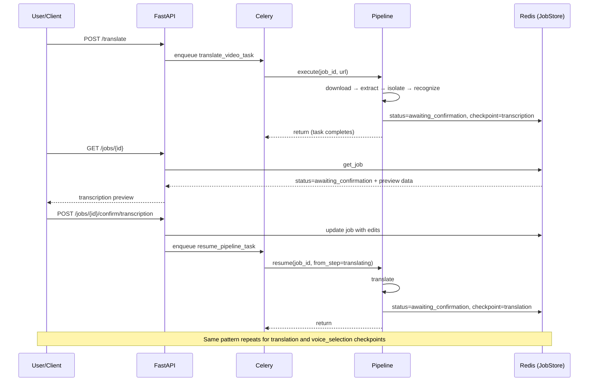

# Design Document: Pipeline Preview & Confirm

## Overview

This feature adds checkpoint/pause functionality to the Douyin video translation pipeline, allowing users to preview and confirm results at three critical stages before the pipeline continues. The pipeline will pause after:

1. **Transcription** — User reviews/edits Chinese speech recognition results
2. **Translation** — User reviews/edits Vietnamese translation
3. **Voice Selection** — User listens to voice previews and selects preferred voice

The design extends the existing `TranslationPipeline` orchestrator with a state-machine-based pause/resume mechanism, adds new confirmation API endpoints, and introduces a checkpoint timeout system.

### Design Rationale

The current pipeline runs end-to-end without user intervention. Errors in speech recognition propagate through translation and synthesis, producing poor results. By pausing at checkpoints, users can correct errors early, improving final output quality without re-running the entire pipeline.

## Architecture



### Key Architectural Decisions

1. **Task-per-segment approach**: Each pipeline segment (before and after each checkpoint) runs as a separate Celery task. When the pipeline pauses, the current task completes and returns. Resumption enqueues a new task. This avoids long-lived blocked workers.

2. **Stateless resumption**: All state needed to resume lives in Redis (JobState + artifacts). Any worker can pick up a resume task — no worker affinity required.

3. **Optimistic locking for confirmations**: A `confirmation_lock` field in JobState prevents concurrent confirmations on the same job.

## Components and Interfaces

### Modified Components

#### `JobStatus` Enum (app/models/job.py)

```python
class JobStatus(str, Enum):
    QUEUED = "queued"
    PROCESSING = "processing"
    AWAITING_CONFIRMATION = "awaiting_confirmation"  # NEW
    COMPLETED = "completed"
    FAILED = "failed"
    CANCELLED = "cancelled"
    EXPIRED = "expired"  # NEW
```

#### `CheckpointType` Enum (new, app/models/job.py)

```python
class CheckpointType(str, Enum):
    TRANSCRIPTION = "transcription"
    TRANSLATION = "translation"
    VOICE_SELECTION = "voice_selection"
```

#### `JobState` Model (extended)

```python
class JobState(BaseModel):
    # ... existing fields ...
    checkpoint_type: Optional[CheckpointType] = None
    checkpoint_entered_at: Optional[datetime] = None
    confirmation_lock: bool = False
    voice_options: Optional[list[VoiceOption]] = None
```

#### `VoiceOption` Model (new, app/models/job.py)

```python
class VoiceOption(BaseModel):
    voice_id: str
    voice_name: str
    preview_url: str
```

### New Components

#### `CheckpointManager` (app/services/checkpoint_manager.py)

Encapsulates checkpoint logic: pause, resume, timeout, and validation.

```python
class CheckpointManager:
    def __init__(self, job_store: JobStoreProtocol):
        self._job_store = job_store

    def pause_at_checkpoint(self, job_id: str, checkpoint_type: CheckpointType) -> None:
        """Transition job to awaiting_confirmation at the given checkpoint."""

    def validate_confirmation(self, job_id: str, expected_checkpoint: CheckpointType) -> JobState:
        """Validate job is at expected checkpoint and acquire confirmation lock.
        Raises appropriate errors for wrong state, wrong checkpoint, or concurrent lock."""

    def apply_transcription_edits(self, job_id: str, edits: list[SegmentEdit]) -> None:
        """Apply user edits to transcription artifacts."""

    def apply_translation_edits(self, job_id: str, edits: list[TranslationEdit]) -> None:
        """Apply user edits to translation artifacts."""

    def confirm_and_resume(self, job_id: str) -> PipelineStep:
        """Release lock, set status to processing, return next step."""

    def check_expired_jobs(self) -> list[str]:
        """Find and expire jobs that have been awaiting > 24h. Returns expired job IDs."""

    def reset_expiration(self, job_id: str) -> None:
        """Reset the 24h expiration timer (called on status query)."""
```

#### Confirmation API Routes (app/api/confirmation_routes.py)

```python
router = APIRouter(prefix="/api/v1/jobs", tags=["confirmation"])

@router.post("/{job_id}/confirm/transcription")
def confirm_transcription(job_id: str, body: TranscriptionConfirmRequest) -> ConfirmResponse: ...

@router.post("/{job_id}/confirm/translation")
def confirm_translation(job_id: str, body: TranslationConfirmRequest) -> ConfirmResponse: ...

@router.post("/{job_id}/confirm/voice")
def confirm_voice(job_id: str, body: VoiceConfirmRequest) -> ConfirmResponse: ...
```

#### Resume Pipeline Task (app/tasks/resume_task.py)

```python
@celery_app.task(name="resume_pipeline")
def resume_pipeline_task(job_id: str, from_step: str) -> dict[str, str]:
    """Resume pipeline execution from a specific step after confirmation."""
```

#### Checkpoint Expiry Task (app/tasks/expiry_task.py)

```python
@celery_app.task(name="check_checkpoint_expiry")
def check_checkpoint_expiry_task() -> dict[str, int]:
    """Periodic task to expire stale awaiting_confirmation jobs."""
```

### Modified Pipeline Flow

The `TranslationPipeline._execute_step` method is modified to check whether the completed step is a checkpoint step. If so, it calls `CheckpointManager.pause_at_checkpoint()` and raises a new `CheckpointPauseSignal` exception that causes the task to complete cleanly (not as an error).

```python
CHECKPOINT_AFTER_STEP: dict[PipelineStep, CheckpointType] = {
    PipelineStep.RECOGNIZING_SPEECH: CheckpointType.TRANSCRIPTION,
    PipelineStep.TRANSLATING: CheckpointType.TRANSLATION,
    PipelineStep.SYNTHESIZING_VOICE: CheckpointType.VOICE_SELECTION,
}
```

## Data Models

### Request/Response Schemas

#### TranscriptionConfirmRequest

```python
class SegmentEdit(BaseModel):
    index: int = Field(ge=0)
    text: str = Field(max_length=500)

class TranscriptionConfirmRequest(BaseModel):
    edits: Optional[list[SegmentEdit]] = None  # None = confirm without edits
```

#### TranslationConfirmRequest

```python
class TranslationEdit(BaseModel):
    index: int = Field(ge=0)
    translated_text: str = Field(max_length=5000)

class TranslationConfirmRequest(BaseModel):
    edits: Optional[list[TranslationEdit]] = None
```

#### VoiceConfirmRequest

```python
class VoiceConfirmRequest(BaseModel):
    voice_id: str = Field(min_length=1)
```

#### ConfirmResponse

```python
class ConfirmResponse(BaseModel):
    job_id: str
    status: str
    next_step: str
    message: str
```

#### Extended JobStatusResponse

```python
class JobStatusResponse(BaseModel):
    # ... existing fields ...
    checkpoint_type: Optional[str] = None
    preview_data: Optional[PreviewData] = None

class PreviewData(BaseModel):
    transcription_segments: Optional[list[TranscriptionPreviewSegment]] = None
    translation_segments: Optional[list[TranslationPreviewSegment]] = None
    voice_options: Optional[list[VoiceOptionResponse]] = None

class TranscriptionPreviewSegment(BaseModel):
    index: int
    start: float
    end: float
    text: str
    confidence: float

class TranslationPreviewSegment(BaseModel):
    index: int
    start: float
    end: float
    original_text: str
    translated_text: str

class VoiceOptionResponse(BaseModel):
    voice_id: str
    voice_name: str
    preview_url: str
```

### Redis Data Structure

Job state in Redis remains a single JSON blob per job. The `artifacts` dict gains new keys:

| Key | Value | Set At |
|-----|-------|--------|
| `transcription_path` | Path to transcription JSON | After speech recognition |
| `translation_path` | Path to translation JSON | After translation |
| `voice_previews_dir` | Path to voice preview audio directory | After voice preview generation |
| `selected_voice_id` | User's selected voice ID | After voice confirmation |

### Voice Preview Artifacts

Voice previews are stored as MP3 files in `{work_dir}/voice_previews/`:
- `{voice_id}_preview.mp3` — 5-15 second audio samples
- `voice_options.json` — metadata about available options

The preview audio URL is constructed as: `/api/v1/jobs/{job_id}/preview/voice/{voice_id}`

## Correctness Properties

*A property is a characteristic or behavior that should hold true across all valid executions of a system — essentially, a formal statement about what the system should do. Properties serve as the bridge between human-readable specifications and machine-verifiable correctness guarantees.*

### Property 1: Checkpoint pause preserves results

*For any* pipeline job and any checkpoint step (transcription, translation, or voice preview), when that step completes, the job status SHALL transition to "awaiting_confirmation" with the correct checkpoint_type, and the step's result SHALL be retrievable from the stored artifacts.

**Validates: Requirements 1.1, 1.2, 1.3**

### Property 2: No progression while awaiting confirmation

*For any* job in "awaiting_confirmation" status, attempting to execute the next pipeline step SHALL have no effect on the job's artifacts or status until a valid confirmation is received.

**Validates: Requirements 1.4, 1.5**

### Property 3: Confirmation without edits preserves original data

*For any* job at any checkpoint, submitting a confirmation with no edits SHALL result in the pipeline resuming from the next step with the stored result unchanged from its pre-confirmation state.

**Validates: Requirements 1.8, 2.2, 3.2**

### Property 4: Confirmation with edits replaces stored result

*For any* job at a checkpoint and any valid set of edits, submitting a confirmation with those edits SHALL result in the stored result being updated to reflect exactly the edits, and the pipeline resuming from the next step using the edited data.

**Validates: Requirements 1.6, 2.3, 3.3**

### Property 5: Partial edits preserve unmodified segments

*For any* transcription or translation result with N segments, and any subset S of segment indices included in an edit submission, segments at indices NOT in S SHALL remain byte-for-byte identical to their pre-edit state after the edit is applied.

**Validates: Requirements 2.4, 3.4**

### Property 6: Whitespace-only text exclusion

*For any* string composed entirely of whitespace characters (spaces, tabs, newlines, etc.) submitted as segment text or translated_text, that segment SHALL be excluded from subsequent pipeline processing steps.

**Validates: Requirements 2.5, 3.5**

### Property 7: Segment text length validation

*For any* transcription edit where segment text exceeds 500 characters, OR any translation edit where translated_text exceeds 5000 characters, the API SHALL reject the entire submission with a validation error, and the stored data SHALL remain unchanged.

**Validates: Requirements 2.6, 3.3**

### Property 8: Invalid segment index rejection

*For any* edit submission referencing a segment index that is negative or >= the total number of segments in the stored result, the API SHALL reject the entire submission with an error indicating the invalid index.

**Validates: Requirements 3.6**

### Property 9: Status response includes correct preview data at checkpoint

*For any* job in "awaiting_confirmation" status, the job status response SHALL include the checkpoint_type field matching the active checkpoint, AND the preview_data field containing the full data for that checkpoint type (transcription segments, translation segments, or voice options respectively).

**Validates: Requirements 6.1, 6.2, 6.3, 6.4**

### Property 10: Non-awaiting jobs omit checkpoint fields

*For any* job NOT in "awaiting_confirmation" status, the status response SHALL return checkpoint_type as null and preview_data as null.

**Validates: Requirements 6.6**

### Property 11: Confirmation for wrong job status returns 409

*For any* job in a status other than "awaiting_confirmation" (queued, processing, completed, failed, cancelled, expired), submitting any confirmation request SHALL return HTTP 409 with an error indicating the current status.

**Validates: Requirements 5.4**

### Property 12: Confirmation for wrong checkpoint type returns 409

*For any* job in "awaiting_confirmation" status at checkpoint X, submitting a confirmation targeting checkpoint Y (where Y ≠ X) SHALL return HTTP 409 indicating which checkpoint the job is currently awaiting.

**Validates: Requirements 5.7**

### Property 13: Valid confirmation returns updated status and enqueues resumption

*For any* valid confirmation request, the API response SHALL include the updated job status as "processing" and the correct next pipeline step name, and a pipeline resume task SHALL be enqueued.

**Validates: Requirements 5.6**

### Property 14: Status query resets expiration timer

*For any* job in "awaiting_confirmation" status, querying its status SHALL reset the expiration timer to 24 hours from the time of the query.

**Validates: Requirements 7.3**

### Property 15: Preview segment selection uses longest under 15 seconds

*For any* set of translated segments, the voice preview SHALL be generated using the segment with the longest text that does not exceed 15 seconds of estimated speech duration.

**Validates: Requirements 4.4**

## Error Handling

### Confirmation Errors

| Condition | HTTP Status | Error Code | Behavior |
|-----------|------------|------------|----------|
| Job not found | 404 | JOB_NOT_FOUND | Return error |
| Job not awaiting confirmation | 409 | NOT_AWAITING_CONFIRMATION | Return current status |
| Wrong checkpoint type | 409 | WRONG_CHECKPOINT | Return expected checkpoint |
| Concurrent confirmation | 409 | CONFIRMATION_IN_PROGRESS | Return retry message |
| Expired job | 410 | JOB_EXPIRED | Return expiration message |
| Segment text too long | 422 | SEGMENT_TOO_LONG | Return max length |
| Invalid segment index | 422 | INVALID_SEGMENT_INDEX | Return valid range |
| Voice unavailable | 422 | VOICE_UNAVAILABLE | Return current options |

### Pipeline Resumption Errors

If pipeline resumption fails after confirmation:
1. Job status transitions to "failed" with error details
2. Error includes the step that failed and whether it's retryable
3. User can see failure via GET /jobs/{id}

### Voice Preview Generation Failures

- If < 2 voice previews generate successfully → job transitions to "failed"
- If >= 2 but not all succeed → return only successful options (Requirement 4.6)

### Timeout Handling

- Periodic Celery Beat task runs every 30 seconds (well within the 60s requirement)
- Scans all jobs with `status=awaiting_confirmation` and `checkpoint_entered_at` older than 24h (adjusted by last status query)
- Expired jobs: status → "expired", working directory deleted, removed from active set

## Testing Strategy

### Property-Based Tests (Hypothesis)

The project already uses Hypothesis (`.hypothesis/` directory exists). Each correctness property maps to a property-based test with minimum 100 iterations.

**Library**: `hypothesis` (already installed)
**Configuration**: `@settings(max_examples=100)`
**Tag format**: `# Feature: pipeline-preview-confirm, Property {N}: {description}`

Properties 1–15 above will each be implemented as a dedicated property-based test that:
- Generates random valid pipeline states and inputs using Hypothesis strategies
- Exercises the `CheckpointManager` and pipeline logic
- Asserts the universal property holds for all generated inputs

### Unit Tests (pytest)

- Endpoint validation (correct schemas accepted/rejected)
- Specific edge cases: concurrent confirmation lock, expired job confirmation
- Voice preview generation with mocked TTS (integration-style)
- Celery Beat schedule verification for expiry task

### Integration Tests

- Full pipeline flow with mocked services: create job → checkpoint → confirm → resume → complete
- Timeout scenario: create job → wait → verify expiration
- Multiple checkpoints: transcription edit → translation edit → voice selection → completion

### Test Organization

```
tests/
├── properties/
│   └── test_checkpoint_properties.py   # All 15 property-based tests
├── unit/
│   ├── test_checkpoint_manager.py      # Unit tests for CheckpointManager
│   ├── test_confirmation_routes.py     # API endpoint tests
│   └── test_voice_preview.py           # Voice preview logic
└── integration/
    └── test_pipeline_checkpoints.py    # End-to-end flow tests
```
